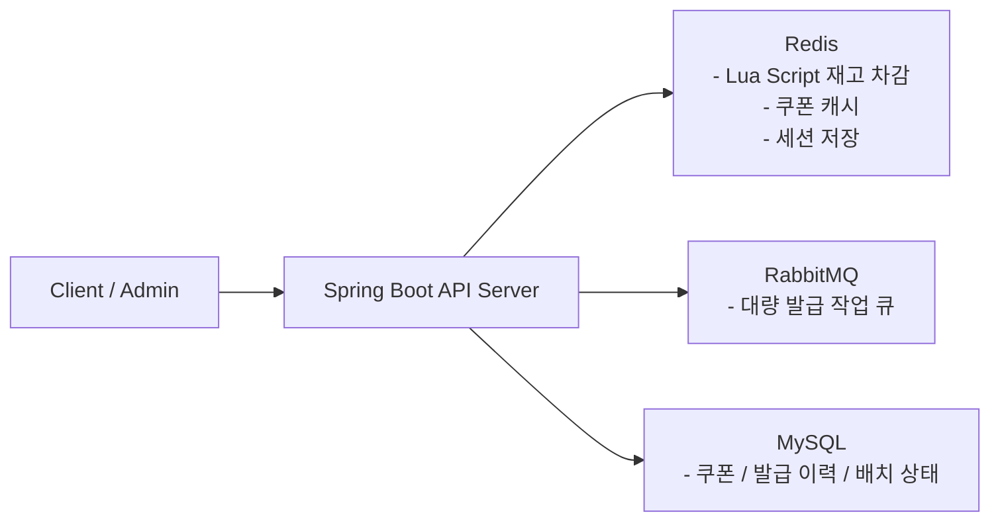
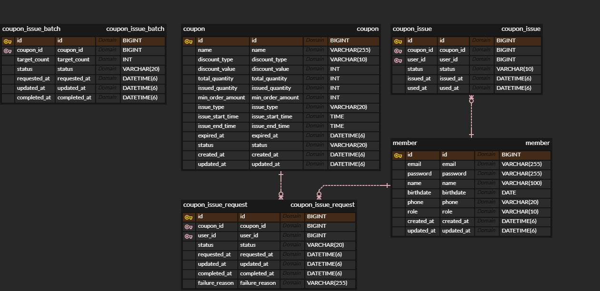

# 대량 쿠폰 발급 시스템

> 선착순 쿠폰 발급의 동시성 문제와 관리자 대량 발급의 비동기 처리 문제를 해결하기 위해 만든 Spring Boot 백엔드 프로젝트

 

## 1. 프로젝트 소개

이 프로젝트는 이커머스 이벤트 환경을 가정해, 쿠폰 발급에서 자주 발생하는 두 가지 문제를 해결하는 데 초점을 맞췄습니다.

- 선착순 쿠폰 발급 시 여러 사용자가 동시에 요청해도 재고 초과와 중복 발급이 발생하지 않아야 합니다.
- 관리자 대량 발급 시 수만~수십만 건 요청을 API 요청 스레드에서 직접 처리하지 않고 안정적으로 비동기 처리해야 합니다.

이를 위해 다음과 같은 방향으로 설계했습니다.

- 선착순 발급: `Redis Lua Script` 기반 원자 연산으로 재고 차감과 중복 체크 처리
- 관리자 대량 발급: `RabbitMQ` 기반 비동기 배치 처리와 `JdbcTemplate` 멀티 VALUES INSERT 적용
- 정합성 보강: DB Unique 제약, Redis rollback, `afterCommit` 후처리, 배치 복구 스케줄러 추가

---

## 2. 기술 스택

### Backend

### Data / Infra

---

## 3. 아키텍처

### 역할 분리
- `Redis`: 선착순 발급의 빠른 판정과 동시성 제어, 쿠폰 조회 캐시, 세션 저장소
- `RabbitMQ`: 관리자 대량 발급 작업을 API 요청과 분리해 비동기로 처리
- `MySQL`: 쿠폰, 발급 이력, 배치 상태의 최종 영속 저장소

---

## 4. ERD

### 주요 테이블
- `coupon`: 쿠폰 템플릿과 발급 규칙을 저장하며, `issued_quantity`를 반정규화해 재고 조회 비용을 줄였습니다.
- `coupon_issue`: 사용자별 발급 이력을 관리하며, `UNIQUE (user_id, coupon_id)`로 중복 발급을 방지합니다.
- `coupon_issue_batch`: 관리자 대량 발급 요청 단위를 저장하며, 배치 상태 추적과 복구 기준이 됩니다.
- `coupon_issue_request`: 선착순 발급의 접수 상태를 저장하며, `coupon_issue`(최종 발급 결과)와 별개로 큐 처리 진행 상황을 추적합니다.

---

## 5. 핵심 기능 / 기술 포인트

### 선착순 쿠폰 발급
- 사용자 직접 발급 요청
- `Redis Lua Script` 기반 중복 체크 + 재고 차감
- 당첨 확정 후 DB 반영은 `RabbitMQ` 큐로 순차 처리해 동시 쓰기 경합 제거
- 발급 요청 상태 조회 (`PENDING` → `PROCESSING` → `SUCCESS` / `FAILED`)
- 쿠폰 사용 / 복원
- 내 쿠폰 목록 조회

### 관리자 대량 발급
- 관리자 배치 발급 요청
- `RabbitMQ Work Queue` 기반 비동기 처리
- `PENDING -> PROCESSING -> DONE / FAILED` 상태 전이
- 배치 상태 조회

### 운영성 보강
- 만료 쿠폰 자동 처리 스케줄러
- 배치 고착 복구 스케줄러
- Redis rollback과 DB Unique 제약을 함께 사용한 정합성 보강

---

## 6. 기술적 도전과 해결

### 1) 비관적 락 기반 선착순 발급의 성능 한계
- 초기에는 비관적 락으로 정합성을 보장했습니다.
- 하지만 동시 요청이 몰릴수록 DB 락과 커넥션 풀이 병목이 됐습니다.
- 이를 개선하기 위해 Redis Lua Script로 전환해 재고 차감과 중복 체크를 원자적으로 처리했습니다.

### 2) Redis와 DB 간 정합성 보강
- Redis에서 선점 성공 후 DB 저장이 실패하면 상태가 어긋날 수 있습니다.
- 쿠폰 생성 후 Redis 초기화는 `afterCommit`에서 실행하고, 저장 실패 시 Redis rollback 로직으로 상태를 복구하도록 설계했습니다.

### 3) 선착순 발급의 동시 쓰기 데드락
- Redis로 당첨자를 가려낸 뒤에도, 당첨된 수백 명이 거의 동시에 `coupon`/`coupon_issue`를 갱신하면서 DB 데드락이 발생했습니다.
- 당첨 즉시 DB에 쓰지 않고 `coupon_issue_request`에 `PENDING`으로 먼저 기록한 뒤 RabbitMQ에 발행하고, 컨슈머(`FirstComeIssueProcessor`)가 메시지를 하나씩 순차 소비해 반영하도록 바꿨습니다. 동시 쓰기 자체가 없어지므로 데드락이 구조적으로 사라집니다.
- 사용자는 발급 결과를 기다리지 않고 접수 응답을 즉시 받고, 이후 상태 조회 API로 최종 결과를 확인합니다.

### 4) 관리자 대량 발급의 요청-처리 분리
- 대량 발급을 요청 스레드에서 직접 처리하면 응답 지연과 스레드 점유가 커집니다.
- 관리자 요청은 `coupon_issue_batch`에 저장한 뒤 RabbitMQ에 작업 메시지를 발행하고, 실제 발급은 `BatchProcessor`가 비동기로 처리하도록 분리했습니다.

### 5) 배치 고착 복구
- RabbitMQ 발행 실패나 프로세스 비정상 종료가 발생하면 배치가 `PENDING` 또는 `PROCESSING` 상태에 고착될 수 있습니다.
- 이를 위해 `BatchRecoveryScheduler`를 두고 timeout이 지난 배치를 `FAILED`로 전환하도록 했습니다.

---

## 7. 주요 API

| 기능 | 메서드 | 경로 |
|------|--------|------|
| 회원가입 | `POST` | `/api/members/signup` |
| 로그인 | `POST` | `/api/members/login` |
| 쿠폰 생성 | `POST` | `/api/coupons` |
| 쿠폰 목록 조회 | `GET` | `/api/coupons` |
| 선착순 쿠폰 발급 요청 | `POST` | `/api/coupons/{couponId}/issue` |
| 발급 요청 상태 조회 | `GET` | `/api/coupons/issue-requests/{requestId}` |
| 내 쿠폰 조회 | `GET` | `/api/coupons/my` |
| 쿠폰 사용 | `POST` | `/api/coupons/{couponId}/use` |
| 관리자 대량 발급 요청 | `POST` | `/api/coupons/{couponId}/batch-issue` |
| 배치 상태 조회 | `GET` | `/api/coupons/batches/{batchId}` |
| 월별 통계 조회 | `GET` | `/api/coupons/stats/monthly?year={year}` |
