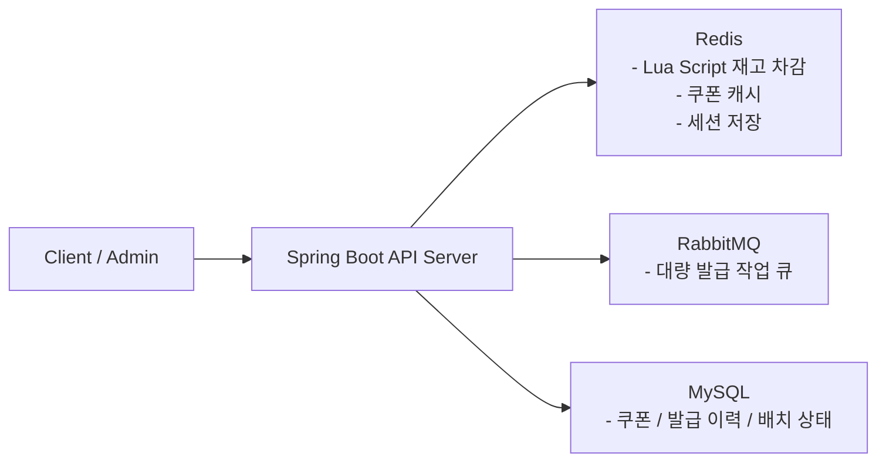

# 대량 쿠폰 발급 시스템

> 선착순 쿠폰 발급의 동시성 문제와 관리자 대량 발급의 처리 성능 문제를 해결하기 위해 만든 Spring Boot 백엔드 프로젝트

<br/>

## 목차
- [기술 스택](#기술-스택)
- [프로젝트 소개](#프로젝트-소개)
- [핵심 기능](#핵심-기능)
- [시스템 아키텍처](#시스템-아키텍처)
- [프로젝트 구조](#프로젝트-구조)
- [데이터 모델](#데이터-모델)
- [기술적 도전과 해결](#기술적-도전과-해결)
- [테스트와 성과](#테스트와-성과)

---

## 기술 스택

### Backend


### Data / Infra


---

## 프로젝트 소개

이 프로젝트는 이커머스 이벤트 환경을 가정해, 쿠폰 발급에서 자주 발생하는 두 가지 문제를 해결하는 데 초점을 맞췄습니다.

- 선착순 쿠폰 발급 시 여러 사용자가 동시에 요청해도 재고 초과와 중복 발급이 발생하지 않아야 한다.
- 관리자 대량 발급 시 수만~수십만 건 요청을 API 요청 스레드에서 직접 처리하지 않고 안정적으로 비동기 처리해야 한다.

이를 위해 다음과 같은 방향으로 설계했습니다.

- 선착순 발급: `Redis Lua Script` 기반 원자 연산으로 재고 차감과 중복 체크 처리
- 관리자 대량 발급: `RabbitMQ` 기반 비동기 배치 처리와 `JdbcTemplate` 멀티 VALUES INSERT 적용
- 정합성 보강: DB Unique 제약, Redis rollback, `afterCommit` 후처리, 배치 복구 스케줄러 추가

---

## 핵심 기능

### 1) 회원 / 인증
- 회원가입
- 로그인 / 로그아웃
- Spring Security 세션 기반 인증
- Spring Session + Redis 세션 저장

### 2) 쿠폰 관리
- 관리자 쿠폰 생성
- 쿠폰 목록 조회 / 단건 조회
- 쿠폰 비활성화
- 쿠폰 월별 발급 통계 조회

### 3) 선착순 쿠폰 발급
- 사용자 직접 발급 요청
- Redis Lua Script 기반 중복 체크 + 재고 차감
- 쿠폰 사용 / 복원
- 내 쿠폰 목록 조회

### 4) 관리자 대량 발급
- 관리자 배치 발급 요청
- RabbitMQ Work Queue 기반 비동기 처리
- `PENDING -> PROCESSING -> DONE / FAILED` 상태 전이
- 배치 상태 조회
- 고착 배치 복구 스케줄러

### 5) 운영성 보강
- 만료 쿠폰 자동 처리 스케줄러

---

## 시스템 아키텍처



### 역할 분리
- `Redis`: 선착순 발급의 빠른 판정과 동시성 제어, 쿠폰 조회 캐시, 세션 저장소
- `RabbitMQ`: 관리자 대량 발급 작업을 API 요청과 분리해 비동기로 처리
- `MySQL`: 쿠폰, 발급 이력, 배치 상태의 최종 영속 저장소

---

## 프로젝트 구조

| 패키지 | 역할 |
|:---:|:---|
| `member` | 회원가입, 로그인, 세션 인증 관련 API와 도메인 |
| `coupon.domain` | `Coupon`, `CouponIssue`, `CouponIssueBatch` 및 상태 전이 규칙 |
| `coupon.service` | 선착순 발급, Redis 연동, 캐시, 관리자 배치 요청 처리 |
| `coupon.infra` | RabbitMQ 소비자, 만료 스케줄러, 배치 복구 스케줄러 |
| `coupon.repository` | 쿠폰 / 발급 이력 / 배치 상태 조회 및 업데이트 |
| `coupon.dto` | 요청/응답 DTO, 캐시 DTO, 통계 Projection |
| `global.config` | Redis, Cache, RabbitMQ, Web 설정 |
| `global.security` | Security 설정, UserDetails, 인증 처리 |
| `global.exception` | `BusinessException`, `ErrorCode`, 전역 예외 응답 |

<details>
<summary>패키지 트리 보기</summary>

```text
src/main/java/com/hwan/coupon
├─ member
│  └─ dto
├─ coupon
│  ├─ domain
│  ├─ dto
│  ├─ infra
│  ├─ repository
│  └─ service
└─ global
   ├─ config
   ├─ exception
   └─ security
```

</details>

---

## 데이터 모델

### 주요 테이블

#### `coupon`
- 쿠폰 템플릿 테이블
- `issued_quantity`를 반정규화해 재고 조회 시 집계 비용을 줄임
- `issue_type`, `status`, `expired_at`, `issue_start_time`, `issue_end_time` 등 발급 규칙 보유

#### `coupon_issue`
- 사용자별 쿠폰 발급 이력
- `UNIQUE (user_id, coupon_id)`로 중복 발급 방지
- `coupon_id` 단독 인덱스로 집계/삭제/만료 처리 조회 보강

#### `coupon_issue_batch`
- 관리자 대량 발급 요청 단위 저장
- `status + requested_at` 복합 인덱스로 고착 배치 복구 조회 최적화

### DB 마이그레이션
- `V1__init.sql`: 기본 테이블 생성
- `V2__change_issue_time_column_type.sql`: 발급 시간 컬럼을 `VARCHAR`에서 `TIME`으로 변경
- `V3__add_fk_and_indexes.sql`: FK 제약, 인덱스, 컬럼 길이 보강

---

## 기술적 도전과 해결

### 1) 선착순 발급 동시성 제어

초기에는 비관적 락 기반으로 재고 초과 발급을 막았습니다.  
정합성은 확보했지만, 동시 요청이 몰릴수록 DB 락과 커넥션 풀이 병목이 되었습니다.

이를 개선하기 위해 Redis Lua Script로 전환했습니다.

- `SISMEMBER`: 이미 발급받은 사용자인지 확인
- `GET`: 현재 재고 확인
- `DECR`: 재고 1 감소
- `SADD`: 발급자 Set에 사용자 추가

이 네 연산을 Redis 서버 안에서 원자적으로 수행해 초과 발급과 중복 발급을 동시에 방지했습니다.

### 2) Redis와 DB 정합성 보강

Redis에서 선점 성공 후 DB 저장이 실패하면 Redis와 DB 상태가 어긋날 수 있습니다.  
이를 줄이기 위해 다음 보강을 적용했습니다.

- 쿠폰 생성 후 Redis 재고 초기화는 `afterCommit`에서 실행
- DB Unique 제약 위반 시 `rollbackStockOnly()`로 재고만 복구
- 그 외 예외는 `rollback()`으로 재고와 발급자 명단을 함께 복구

즉, Redis는 빠른 판정 계층으로 쓰되 최종 정합성은 DB와 함께 맞추는 구조로 설계했습니다.

### 3) 관리자 대량 발급 비동기 처리

대량 발급을 API 요청 스레드에서 직접 처리하면 응답 지연과 스레드 점유가 커집니다.  
그래서 관리자 요청은 먼저 `coupon_issue_batch`에 저장한 뒤, RabbitMQ에 작업 메시지를 발행하고 API는 즉시 응답하도록 설계했습니다.

- Producer: `AdminBatchService`
- Queue Consumer: `BatchProcessor`
- 상태 관리: `PENDING -> PROCESSING -> DONE / FAILED`

실제 발급은 `BatchProcessor`가 1000건씩 분할해 `INSERT IGNORE` 멀티 VALUES SQL로 처리합니다.

### 4) 배치 고착 복구

RabbitMQ 발행 실패나 프로세스 비정상 종료가 발생하면 배치가 `PENDING` 또는 `PROCESSING` 상태에 고착될 수 있습니다.  
이를 위해 `BatchRecoveryScheduler`를 두고 timeout이 지난 배치를 `FAILED`로 전환하도록 했습니다.

- `PENDING`: 발행 실패 가능성 기준 복구
- `PROCESSING`: 비정상 종료 가능성 기준 복구

현재는 `requested_at` 기준으로 복구하며, 이후 더 정밀한 기준이 필요하면 상태 전환 시각 컬럼을 추가하는 방향으로 확장할 수 있습니다.

---

## 테스트와 성과

### 테스트 구성

- 단위 테스트
  - `CouponTest`
  - `CouponIssueTest`
  - `CouponServiceTest`
  - `AdminBatchServiceTest`
  - `MemberServiceTest`
  - `CouponExpirySchedulerTest`
  - `BatchRecoverySchedulerTest`
- 통합 테스트
  - `CouponIssueConcurrencyTest`
  - `AdminBatchIntegrationTest`
- 인프라 의존 통합 테스트는 `Testcontainers`로 MySQL / Redis / RabbitMQ를 재현

### 부하 테스트 결과

`3,000명 vs 쿠폰 100개` 조건에서 두 방식 모두 정합성은 유지했습니다.

| 항목 | 비관적 락 | Redis Lua Script |
|------|-----------|------------------|
| 발급 성공 | 100건 | 100건 |
| 초과 발급 | 0건 | 0건 |
| 중복 발급 | 0건 | 0건 |
| avg 응답 시간 | 1,375ms | 851ms |
| p90 응답 시간 | 4,021ms | 2,350ms |
| p95 응답 시간 | 4,476ms | 2,543ms |

- p90 기준 약 `42%` 단축
- p95 기준 약 `43%` 단축

### 대량 발급 처리 개선

- `JPA saveAll`: 약 `65초`
- `JdbcTemplate` 멀티 INSERT: 약 `2초`

약 `33배` 수준으로 처리 시간을 줄였습니다.

---
