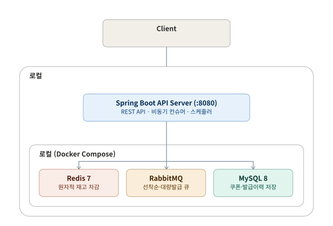
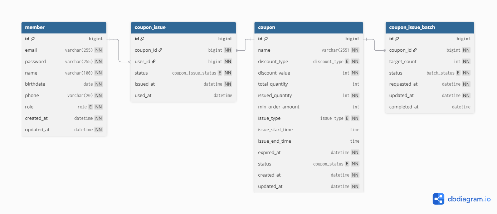

# 대량 쿠폰 발급 시스템

> 선착순 쿠폰 발급의 동시성 문제와 관리자 대량 발급의 비동기 처리 문제를 해결하기 위해 만든 Spring Boot 백엔드 프로젝트

<br/>

## 1. 프로젝트 소개

이 프로젝트는 이커머스 이벤트 환경을 가정해, 쿠폰 발급에서 자주 발생하는 두 가지 문제를 해결하는 데 초점을 맞췄습니다.

- 선착순 쿠폰 발급 시 여러 사용자가 동시에 요청해도 재고 초과와 중복 발급이 발생하지 않아야 합니다.
- 관리자 대량 발급 시 수만~수십만 건 요청을 API 요청 스레드에서 직접 처리하지 않고 안정적으로 비동기 처리해야 합니다.

이를 위해 다음과 같은 방향으로 설계했습니다.

- 선착순 발급: `Redis Lua Script` 기반 원자 연산으로 재고 차감과 중복 체크 처리
- 관리자 대량 발급: `RabbitMQ` 기반 비동기 배치 처리와 `JdbcTemplate` 멀티 VALUES INSERT 적용
- 정합성 보강: DB Unique 제약, 조건부 UPDATE 기반 트랜잭션 경쟁 처리, 배치 복구·대사 스케줄러

---

## 2. 기술 스택

### Backend


### Data / Infra


---

## 3. How to run

### 준비물
- Java 17
- Docker, Docker Compose

### 1) 설정 파일 준비

```bash
cp .env.example .env
cp src/main/resources/application-local.yaml.example src/main/resources/application-local.yaml
```

`.env`와 `application-local.yaml`에 로컬 전용 비밀번호를 채워주세요. **두 파일의 MySQL/RabbitMQ 값이 서로 일치해야 합니다.** 두 파일 모두 git에 커밋되지 않습니다(`.gitignore` 처리됨).

### 2) 인프라 기동

```bash
docker compose up -d
```

MySQL(호스트 `13306`), Redis(`6379`), RabbitMQ(`5672`, 관리 UI `15672`)가 뜹니다. 스키마는 Spring Boot 기동 시 Flyway가 자동으로 적용합니다.

### 3) 서버 실행 (`local` 프로필 필수)

```bash
./gradlew bootRun --args='--spring.profiles.active=local'
```

Windows(cmd/PowerShell): `gradlew.bat bootRun --args="--spring.profiles.active=local"`

### 4) 실제 API로 동작 확인

일반 회원가입은 `USER` 권한만 생성되고, 쿠폰 생성 API는 `ADMIN` 권한이 필요합니다. 운영용 기본 관리자 계정이나 관리자 생성 API는 두지 않았으므로, 로컬 개발 환경에서는 아래처럼 가입한 계정의 권한을 DB에서 직접 바꿉니다.

```bash
# 4-1. 관리자로 쓸 계정과, 발급받을 일반 계정을 각각 회원가입
curl -X POST http://localhost:8080/api/members/signup -H "Content-Type: application/json" -d '{"email":"admin@local.test","password":"password123","name":"admin","birthdate":"1990-01-01","phone":"010-0000-0000"}'
curl -X POST http://localhost:8080/api/members/signup -H "Content-Type: application/json" -d '{"email":"user1@local.test","password":"password123","name":"user1","birthdate":"1990-01-01","phone":"010-1111-1111"}'

# 4-2. 로컬 DB에서 admin@local.test 계정만 ADMIN으로 승격 (개발용 절차, 코드 변경 없음)
# <YOUR_MYSQL_ROOT_PASSWORD>는 .env에 설정한 MYSQL_ROOT_PASSWORD 값으로 바꿔주세요.
docker compose exec mysql mysql -uroot -p<YOUR_MYSQL_ROOT_PASSWORD> coupon \
  -e "UPDATE member SET role='ADMIN' WHERE email='admin@local.test';"

# 4-3. 관리자로 로그인 (권한 변경 후이므로 반드시 새로 로그인해야 세션에 ADMIN 권한이 반영됨)
curl -c admin_cookie.txt -X POST http://localhost:8080/api/members/login -H "Content-Type: application/json" -d '{"email":"admin@local.test","password":"password123"}'

# 4-4. FIRST_COME 쿠폰 생성
curl -b admin_cookie.txt -X POST http://localhost:8080/api/coupons -H "Content-Type: application/json" -d '{
  "name":"first-come-test","discountType":"FIXED","discountValue":1000,
  "totalQuantity":5,"minOrderAmount":null,"issueType":"FIRST_COME",
  "issueStartTime":null,"issueEndTime":null,"expiredAt":"2027-01-01T00:00:00"
}'
# 응답의 "id" 값을 아래 {couponId}에 사용

# 4-5. 일반 사용자로 로그인 후 발급 요청
curl -c user_cookie.txt -X POST http://localhost:8080/api/members/login -H "Content-Type: application/json" -d '{"email":"user1@local.test","password":"password123"}'
curl -b user_cookie.txt -X POST http://localhost:8080/api/coupons/{couponId}/issue
```

마지막 요청은 `202 Accepted`를 반환합니다. **이건 접수 응답이지 최종 DB 발급 완료가 아닙니다** — 실제 반영은 RabbitMQ 큐를 통해 비동기로 처리됩니다. 1~2초 정도 기다린 뒤 아래로 최종 결과를 확인하세요.

```bash
curl -b user_cookie.txt http://localhost:8080/api/coupons/my
```

> Windows에서 터미널의 JSON 요청 본문에 한글을 직접 넣으면 콘솔 인코딩(CP949) 때문에 깨질 수 있습니다. 이름 등은 영문으로 테스트하거나, Postman처럼 UTF-8을 보장하는 클라이언트를 쓰는 걸 권장합니다.

### 5) 테스트 실행

```bash
./gradlew test
```

통합 테스트가 Testcontainers로 MySQL/RabbitMQ 컨테이너를 직접 띄우므로 **Docker가 실행 중이어야 합니다.**

---

## 4. 아키텍처

<p align="center">
   로컬 환경의 Spring Boot API Server -> Docker Compose(Redis 7, RabbitMQ, MySQL 8)" width="700" />
</p>

### 역할 분리
- `Redis`: 선착순 발급의 빠른 판정과 동시성 제어, 쿠폰 조회 캐시, 세션 저장소
- `RabbitMQ`: 관리자 대량 발급 작업을 API 요청과 분리해 비동기로 처리
- `MySQL`: 쿠폰, 발급 이력, 배치 상태의 최종 영속 저장소

---

## 5. ERD



### 주요 테이블
- `coupon`: 쿠폰 템플릿과 발급 규칙을 저장하며, `issued_quantity`를 반정규화해 재고 조회 비용을 줄였습니다.
- `coupon_issue`: 사용자별 발급 이력을 관리하며, `UNIQUE (user_id, coupon_id)`로 중복 발급을 방지합니다.
- `coupon_issue_batch`: 관리자 대량 발급 요청 단위를 저장하며, 배치 상태 추적과 복구 기준이 됩니다.

---

## 6. 핵심 기능 / 기술 포인트

### 선착순 쿠폰 발급
- 사용자 직접 발급 요청
- `Redis Lua Script` 기반 원자적 중복 체크 + 재고 차감
- 당첨 확정 후 DB 반영은 `RabbitMQ` 큐로 짧은 주기(최대 200ms 또는 500건) 배치 처리해 동시 쓰기 경합 제거. 개별 요청 단위 상태 추적은 하지 않으며, 결과는 내 쿠폰함에서 확인합니다.
- 쿠폰 사용 / 복원
- 내 쿠폰 목록 조회

### 관리자 대량 발급
- 관리자 배치 발급 요청
- `RabbitMQ Work Queue` 기반 비동기 처리, 1,000건 단위 청크로 순차 반영
- `PENDING -> PROCESSING -> DONE / FAILED` 상태 전이
- 배치 상태 조회

### 운영성 보강
- 만료 쿠폰 자동 처리 스케줄러 — 발급 가능 상태 전환(ACTIVE→INACTIVE)과 발급 이력 만료(ISSUED→EXPIRED)를 서로 다른 기준으로 처리
- 배치 고착 복구 스케줄러, 선착순 발급 Redis-DB 정합성 대사 스케줄러
- 트랜잭션 커밋 이후로 미뤄지는 캐시 무효화(`RedisCacheManager.transactionAware()`)

---

## 7. 기술적 도전과 해결

### 1) 비관적 락 기반 선착순 발급의 성능 한계
- 초기에는 비관적 락으로 정합성을 보장했습니다.
- 하지만 동시 요청이 몰릴수록 DB 락과 커넥션 풀이 병목이 됐습니다.
- 이를 개선하기 위해 Redis Lua Script로 전환해 재고 차감과 중복 체크를 원자적으로 처리했습니다.

### 2) Redis와 DB 간 정합성 보강
- Redis에서 재고를 선점한 뒤 DB 초기화가 실패하면, 재고 키 자체가 없는 쿠폰이 생길 수 있습니다.
- `GenerationType.IDENTITY`가 `save()` 시점에 이미 ID를 확정해준다는 점을 활용해, 쿠폰 생성과 같은 트랜잭션 안에서 동기로 Redis 재고를 초기화합니다. 이 호출이 실패하면 쿠폰 생성 자체가 롤백됩니다.
- 이미 존재하는 쿠폰의 재고 키가 운영 중 유실되면, 자동으로 재생성하지 않고 발급을 거절(503)합니다. DB의 발급 수량만으로는 유실 시점에 이미 당첨된 사람이 있었는지 알 수 없어, 잘못 재배정하면 오히려 초과 발급으로 이어질 수 있기 때문입니다.

### 3) 선착순 발급의 동시 쓰기 데드락
- Redis로 당첨자를 가려낸 뒤에도, 당첨된 수백 명이 거의 동시에 `coupon`/`coupon_issue`를 갱신하면서 DB 데드락이 발생했습니다.
- 당첨 확정 시 DB에 바로 쓰지 않고 RabbitMQ에 발행한 뒤, 단일 컨슈머(`FirstComeIssueProcessor`)가 짧은 주기로 모아 한 번에 배치 반영하도록 바꿨습니다. 동시 쓰기 자체가 없어지므로 데드락이 구조적으로 사라집니다.
- 사용자는 발급 결과를 기다리지 않고 접수 응답(`202`)을 즉시 받고, 이후 내 쿠폰함 조회로 최종 결과를 확인합니다.

### 4) 관리자 대량 발급의 요청-처리 분리
- 대량 발급을 요청 스레드에서 직접 처리하면 응답 지연과 스레드 점유가 커집니다.
- 관리자 요청은 `coupon_issue_batch`에 저장한 뒤 RabbitMQ에 작업 메시지를 발행하고, 실제 발급은 `BatchProcessor`가 비동기로 처리하도록 분리했습니다.

### 5) 배치 고착 복구
- RabbitMQ 발행 실패나 프로세스 비정상 종료가 발생하면 배치가 `PENDING` 또는 `PROCESSING` 상태에 고착될 수 있습니다.
- `BatchRecoveryScheduler`를 두고 timeout이 지난 배치를 `FAILED`로 전환하도록 했습니다.

### 6) 배치 처리와 복구 스케줄러의 상태 경쟁
- 대량 발급이 청크 단위로 처리되는 도중, 복구 스케줄러가 같은 배치를 고착으로 판단해 동시에 상태를 바꾸려 할 수 있습니다.
- 조회 후 판단하는 대신, 상태를 조건으로 건 UPDATE로 승자를 가립니다(`UPDATE ... WHERE status='PROCESSING'`). MySQL/InnoDB는 이 조건이 매칭되는 순간 해당 행에 커밋까지 락을 걸므로, 두 갱신 중 먼저 커밋되는 쪽이 자연스럽게 승자가 되고 진 쪽은 커밋된 적 없는 데이터만 롤백합니다.

---

## 8. 주요 API

| 기능 | 메서드 | 경로 |
|------|--------|------|
| 회원가입 | `POST` | `/api/members/signup` |
| 로그인 | `POST` | `/api/members/login` |
| 로그아웃 | `POST` | `/api/members/logout` |
| 쿠폰 생성 | `POST` | `/api/coupons` |
| 쿠폰 목록 조회 | `GET` | `/api/coupons` |
| 선착순 쿠폰 발급 요청 | `POST` | `/api/coupons/{couponId}/issue` |
| 내 쿠폰 조회 | `GET` | `/api/coupons/my` |
| 쿠폰 사용 | `POST` | `/api/coupons/{couponId}/use` |
| 쿠폰 복원 | `POST` | `/api/coupons/{couponId}/restore` |
| 관리자 대량 발급 요청 | `POST` | `/api/coupons/{couponId}/batch-issue` |
| 배치 상태 조회 | `GET` | `/api/coupons/batches/{batchId}` |
| 쿠폰 비활성화 | `PATCH` | `/api/coupons/{couponId}/deactivate` |
| 월별 통계 조회 | `GET` | `/api/coupons/stats/monthly?year={year}` |

---

## 9. 알려진 한계

- Redis는 AOF `everysec`로 영속화되어, 장애 시 최근 1초 이내의 쓰기가 유실될 수 있습니다. 이 경우 재고 키 자체는 남아있고 값만 오래된 상태라 "키 부재 시 거절" 로직으로는 감지되지 않습니다.
- 재고 키 유실 시 자동 복구 대신 발급을 거절(503)하도록 설계되어 있어, 실제 복구에는 운영자 개입이 필요합니다.
- 선착순 발급 정합성 대사 스케줄러는 쿠폰별로 Redis 당첨자 전체와 DB 발급자 전체를 매번 비교합니다. 현재 규모에서는 단순하고 충분하지만, 발급량이 크게 늘어나면 스캔 비용도 함께 늘어납니다.
- `coupon:stock:{id}`, `coupon:issued:{id}` Redis 키에는 TTL이나 정리 로직이 없어 쿠폰이 쌓일수록 영구히 누적됩니다. 대사 스케줄러의 대상 쿠폰 범위도 만료 시점과 무관하게 계속 늘어납니다.
- 선착순 발급 컨슈머의 동시 소비자 1개 제한은 애플리케이션 인스턴스 단위입니다. 여러 대로 수평 확장하면 인스턴스 수만큼 소비자가 늘어나며, 이 경우 DB UNIQUE 제약과 원자적 UPDATE가 최종 방어선이 됩니다.
- CSRF 비활성화 등 일부 보안 설정은 "로컬/포트폴리오 시연 환경"이라는 전제에 맞춰져 있습니다. 브라우저 기반 클라이언트로 공개 배포한다면 재검토가 필요합니다.
- `scripts/`에 k6 부하 테스트 스크립트와 과거 측정 결과가 남아 있습니다. 다만 이후 동시성 로직이 여러 차례 수정되어, 예전 결과 수치가 현재 코드의 성능을 그대로 대표하지는 않습니다. 접근 방식(Redis Lua Script vs 비관적 락 등)을 비교한 방법론 참고 자료로 남겨둡니다.
